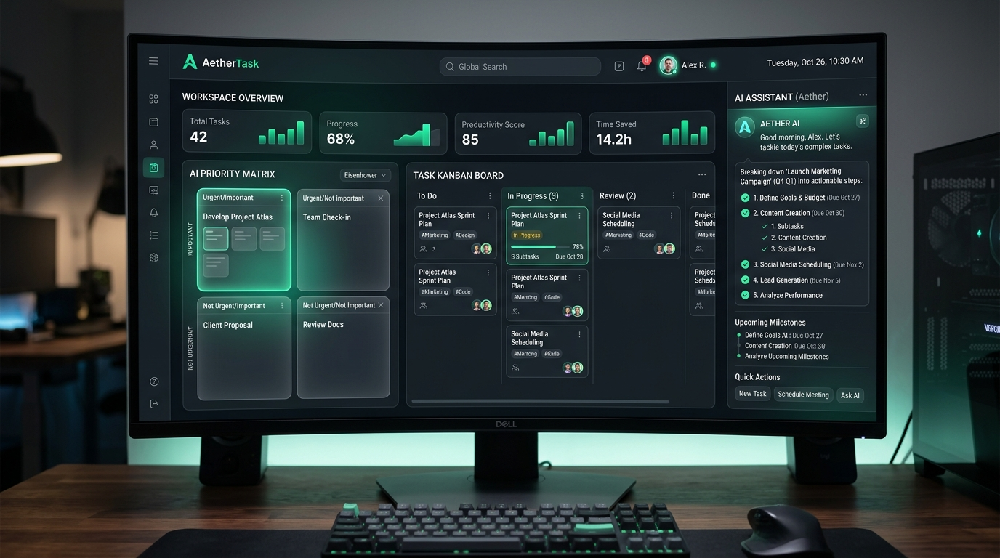
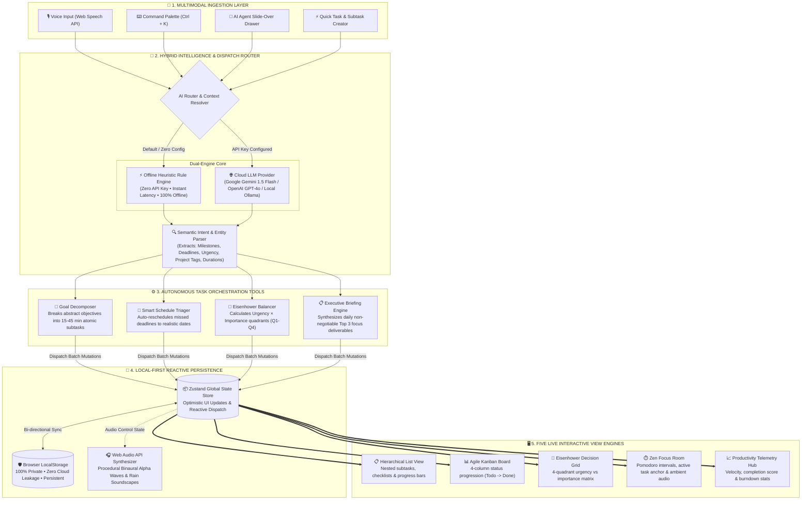
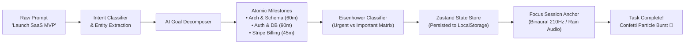
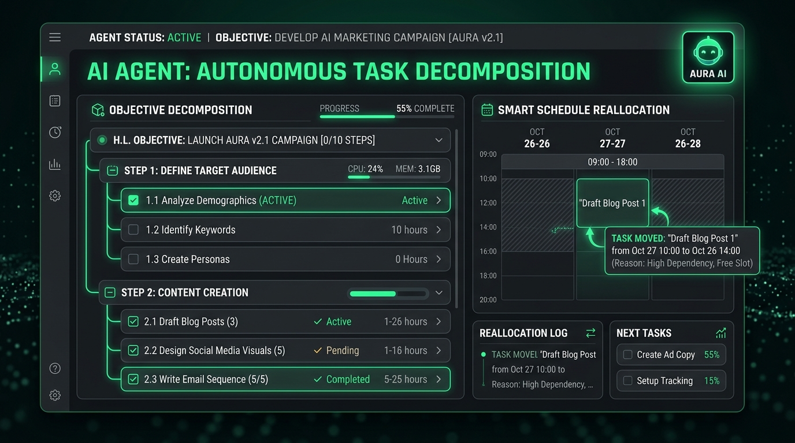
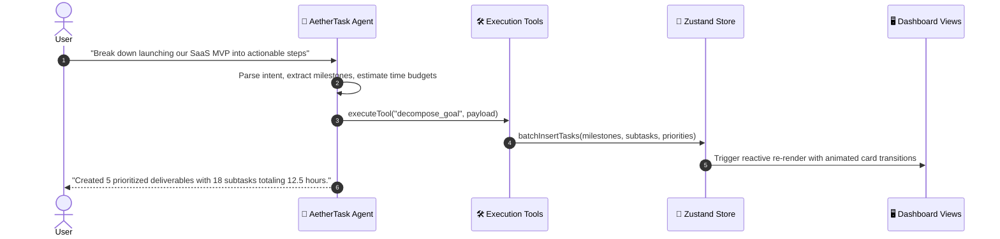
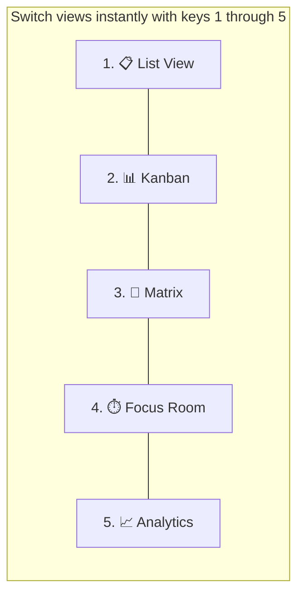

<div align="center">

# ⚡ AetherTask AI
### Autonomous, Local-First Intelligent Task & Productivity Orchestrator

[](https://reactjs.org/)
[](https://www.typescriptlang.org/)
[](https://vitejs.dev/)
[](https://tailwindcss.com/)
[](#-privacy--zero-data-leakage)
[](LICENSE)

<br />

**AetherTask** bridges the gap between static to-do lists and active productivity.  
Powered by an autonomous conversational AI agent, it automatically decomposes ambitious goals into granular milestones, auto-reschedules missed deadlines, balances your Eisenhower priority matrix, and guides deep work sessions with ambient audio synthesis.

---

[🚀 Quick Start](#-quick-start) •
[✨ Key Features](#-key-features) •
[🧠 How It Works (Architecture)](#-how-it-works--interactive-architecture) •
[🤖 AI Agent in Action](#-autonomous-agent-in-action) •
[🖥️ 5 Core Views](#-the-5-supercharged-views) •
[⌨️ Shortcuts](#-keyboard-shortcuts-cheatsheet) •
[🔒 Privacy & Export](#-privacy--zero-data-leakage)

---

</div>

<br />

## 📸 Application Showcase



<br />

---

## ⚡ Why AetherTask? (The Problem with Traditional To-Dos)

Most to-do apps are **passive graveyards for forgotten goals**. You write *"Launch SaaS MVP"* or *"Study Machine Learning"*, and they sit there because humans struggle to start vaguely defined tasks.

| Feature / Capability | Standard To-Do App | ⚡ AetherTask AI |
| :--- | :---: | :---: |
| **Task Creation** | Manual typing of every detail | 🗣️ Voice or natural language prompt |
| **Complex Goal Handling** | Overwhelms the user | 🧩 **Autonomous decomposition** into 15–45 min subtasks |
| **Overdue Deadlines** | Red guilt markers pile up | 🔄 **Smart schedule triage** reallocates deadlines with 1-click |
| **Prioritization** | Guesswork & manual tags | 🎯 **Eisenhower auto-balancing** (Urgent vs Important) |
| **Deep Work Integration** | Needs external Pomodoro apps | 🎧 **Integrated Zen Focus Room** + ambient sound synth |
| **AI Dependency** | Requires costly subscriptions | ⚡ **Built-in Offline Heuristics** (Zero API keys required) |
| **Data Sovereignty** | Stored on third-party servers | 🛡️ **100% Local-first** in browser `localStorage` |

<br />

---

## 🧠 How It Works — Interactive Architecture

AetherTask operates on an **Agent-State-View Reactive Loop**. Below is the comprehensive end-to-end architectural flow demonstrating how multimodal user inputs are parsed by the hybrid intelligence layer, orchestrated via specialized autonomous tools, committed to local-first storage, and reactively rendered across the 5 view engines:



<br />

---

## 🤖 Autonomous Task Lifecycle & Orchestration

The diagram below illustrates how an abstract user goal transforms from a single prompt into structured, actionable items, anchors into a Pomodoro focus session, and tracks completion velocity:



<br />

---

## 🤖 Autonomous Agent in Action



### What the AI Agent Can Do For You

AetherTask is equipped with multi-step autonomous tools that perform operations directly on your board:



### 💡 Interactive Prompts to Try Right Away

Open the **AI Drawer** or press `Ctrl + K` and try pasting any of these commands:

<details>
<summary><b>1. 🚀 Autonomous Goal Decomposition</b> <i>(Click to expand)</i></summary>

```text
"Break down launching a modern SaaS MVP into actionable subtasks with time estimates"
```
> **What the Agent does:** Creates a parent roadmap with phased deliverables (System Architecture, UI/UX Wireframing, Authentication, Core Engine, Stripe Billing, QA Testing) complete with time budgets and checklist items.
</details>

<details>
<summary><b>2. 🔄 Smart Schedule Triage & Recovery</b> <i>(Click to expand)</i></summary>

```text
"Reschedule all my overdue tasks to today and reprioritize them"
```
> **What the Agent does:** Scans the active database, identifies past-due items, re-anchors their due dates to today, adjusts priority according to urgency, and reports the modified tasks back to you.
</details>

<details>
<summary><b>3. 🎯 Eisenhower Matrix Auto-Balancing</b> <i>(Click to expand)</i></summary>

```text
"Re-evaluate my tasks and distribute them across the 4 Eisenhower quadrants"
```
> **What the Agent does:** Analyzes task descriptions and deadlines to sort them intelligently into:
> - **Q1 (Do First):** High-impact & time-critical
> - **Q2 (Schedule):** High-impact strategic deep work
> - **Q3 (Delegate):** Administrative & quick chores
> - **Q4 (Eliminate):** Low-value distractions
</details>

<details>
<summary><b>4. 📋 Morning Focus Briefing</b> <i>(Click to expand)</i></summary>

```text
"Give me a 2-minute morning productivity briefing"
```
> **What the Agent does:** Summarizes your pending agenda, computes your top 3 non-negotiable deliverables for today, and estimates your focus hours required.
</details>

<br />

---

## 🖥️ The 5 Supercharged Views

AetherTask adapts to how your brain works at any moment:



### 1. 📋 Hierarchical List View (`Key 1`)
- **Nested Checklists**: Expandable subtasks with live visual progress bars.
- **One-Click AI Decompose**: Click the ✨ button on any task to break it into atomic steps.
- **Batch Operations**: Multi-select items to mark completed, re-tag, or delete at once.
- **Confetti Engine**: Interactive particle celebration when completing milestones!

### 2. 📊 Agile Kanban Board (`Key 2`)
- **4 Fluid Swimlanes**: `To Do` ➔ `In Progress` ➔ `In Review` ➔ `Completed`.
- **Card-Level Quick Actions**: Transition tasks forward or backward with one click.
- **Badge Indicators**: Instant visual cues for priority, project pill, and subtask completion ratio.

### 3. 🎯 Eisenhower Decision Matrix (`Key 3`)
- **Visual Urgency/Importance Grid**:
  - 🟢 **Quadrant 1 (Do First)**: Urgent & Important
  - 🔵 **Quadrant 2 (Schedule)**: Not Urgent & Important
  - 🟡 **Quadrant 3 (Delegate)**: Urgent & Not Important
  - ⚪ **Quadrant 4 (Eliminate)**: Neither Urgent nor Important
- **Direct Repositioning**: Quickly shift tasks between quadrants via dropdown or dragging.

### 4. ⏱️ Zen Focus Room & Pomodoro (`Key 4`)
- **Targeted Anchoring**: Select any task from your backlog as the active focus anchor.
- **Classic Pomodoro Cycle**: 25m Focus • 5m Short Break • 15m Long Break intervals.
- **Built-in Ambient Sound Synthesizer**: Uses the native **Web Audio API** to generate real-time ambient soundscapes:
  - 🌧️ *Gentle Rain*
  - 🌊 *Binaural Alpha Waves (Focus Frequency)*
  - 💨 *Calming White Noise*
  - *(100% browser synthesized — zero external audio files or bandwidth required!)*

### 5. 📈 Productivity Telemetry Hub (`Key 5`)
- **Dynamic Productivity Score (0–100)**: Evaluates completion velocity, overdue ratio, and focus time.
- **Visual Analytics**: Interactive breakdowns by status distribution, priority ratios, and project workload allocation.

<br />

---

## 🚀 Quick Start

Get AetherTask running locally on your machine in **under 60 seconds**:

### Prerequisites
- [Node.js](https://nodejs.org/) (v18.0.0 or higher recommended)
- `npm`, `pnpm`, or `yarn`

### 1. Clone & Install

```bash
# Clone the repository
git clone https://github.com/your-username/aethertask-ai.git

# Navigate into project directory
cd aethertask-ai

# Install dependencies
npm install
```

### 2. Run the Development Server

```bash
npm run dev
```

Open your browser and visit:  
👉 **`http://localhost:5173/`**

### 3. (Optional) Configure Cloud AI Provider

AetherTask works **100% out of the box with zero configuration** using its built-in rule heuristics.  
If you want to unlock advanced generative capabilities with Google Gemini or OpenAI:

1. Click the **⚙️ Settings** icon in the bottom-left sidebar.
2. Under **AI Provider**, select **Google Gemini** or **OpenAI Compatible**.
3. Paste your API key (stored exclusively in your local browser storage).
4. Click **Save Settings**.

<br />

---

## ⌨️ Keyboard Shortcuts Cheatsheet

Designed for keyboard-first power users who prefer keeping hands on the keys:

| Shortcut | Action | Where it Works |
| :---: | :--- | :--- |
| <kbd>Ctrl</kbd> + <kbd>K</kbd> / <kbd>⌘</kbd> + <kbd>K</kbd> | **Global Command Palette** (Search, jump, or prompt AI) | Anywhere |
| <kbd>N</kbd> | **Create New Task** modal | Anywhere |
| <kbd>1</kbd> | Switch to **List View** | Global |
| <kbd>2</kbd> | Switch to **Kanban View** | Global |
| <kbd>3</kbd> | Switch to **Eisenhower Matrix** | Global |
| <kbd>4</kbd> | Switch to **Zen Focus Room** | Global |
| <kbd>5</kbd> | Switch to **Analytics Dashboard** | Global |
| <kbd>Esc</kbd> | Close any open drawer, modal, or palette | Global |
| <kbd>Space</kbd> | Start / Pause active Pomodoro session | Focus View |

<br />

---

## 🔒 Privacy & Zero Data Leakage

Your productivity habits, personal notes, and work deliverables should belong exclusively to you.

```
                    ┌──────────────────────────────────────────────┐
                    │            YOUR WEB BROWSER                  │
                    │                                              │
                    │   ┌─────────────┐       ┌────────────────┐   │
  User Input ──────►│   │ Zustand App │◄─────►│  LocalStorage  │   │
                    │   │   Engine    │       │ (Encrypted OS) │   │
                    │   └──────┬──────┘       └────────────────┘   │
                    └──────────┼───────────────────────────────────┘
                               │
                [Offline Mode] │ [Optional Cloud LLM Mode]
                               ▼
                    ┌──────────────────────┐
                    │ Built-in Heuristics  │ ◄─── ZERO external network calls!
                    └──────────────────────┘
```

- **Local-First Architecture**: 100% of tasks, tags, projects, and execution logs reside inside your browser's `localStorage`.
- **Zero Tracker Guarantee**: No telemetry, no third-party tracking scripts, and no external analytics cookies.
- **Instant Data Portability**: Export your data anytime in standard formats via **Settings**:
  - 📄 **Markdown (`.md`)**: GitHub / Obsidian / Notion compatible checklist.
  - 📅 **iCalendar (`.ics`)**: Import scheduled tasks directly into Apple Calendar, Google Calendar, or Outlook.
  - 💾 **JSON Backup (`.json`)**: Complete, non-destructive snapshot for backup and multi-device migration.

<br />

---

## 🛠️ Technology Stack

```
Frontend Architecture:
├── Framework:            React 18.3 (TypeScript 5.7)
├── Build Engine:         Vite 6.2 (Sub-second HMR)
├── State Management:     Zustand 5.0 (with persist middleware)
├── Styling & Design:     Tailwind CSS 3.4 (Tailored Slate & Emerald Dark Theme)
├── Icons:                Lucide React
├── Audio Engine:         Native HTML5 Web Audio API (Ambient sound synthesizer)
├── Voice Input:          HTML5 Web Speech Recognition API
├── Animations:           Canvas Confetti + Tailwind Keyframes
└── Date Utilities:       date-fns 4.1
```

<br />

---

## 📁 Repository Structure

```
todo-agent/
├── docs/
│   └── images/
│       ├── banner.jpg           # High-resolution dashboard overview
│       └── workflow.jpg         # Autonomous agent decomposition preview
├── src/
│   ├── components/
│   │   ├── agent/
│   │   │   ├── AgentDrawer.tsx    # Slide-over chat with real-time tool logs
│   │   │   └── CommandPalette.tsx # Ctrl+K global launcher
│   │   ├── layout/
│   │   │   ├── Navbar.tsx         # Top bar with view selector & stats
│   │   │   └── Sidebar.tsx        # Project filters, timeframes & settings trigger
│   │   ├── modals/
│   │   │   ├── TaskModal.tsx      # Task creator with AI decomposition preview
│   │   │   └── SettingsModal.tsx  # Provider setup & backup/export controls
│   │   ├── ui/
│   │   │   └── ToastContainer.tsx # Dynamic action notifications
│   │   └── views/
│   │       ├── ListView.tsx       # Hierarchical list with subtask progress
│   │       ├── KanbanView.tsx     # 4-column Agile drag board
│   │       ├── MatrixView.tsx     # Eisenhower 4-quadrant decision matrix
│   │       ├── FocusView.tsx      # Pomodoro timer + ambient sound generator
│   │       └── AnalyticsView.tsx  # Real-time productivity telemetry
│   ├── services/
│   │   ├── aiService.ts           # Hybrid intelligence & tool execution engine
│   │   └── exportService.ts       # Markdown, JSON & ICS calendar exporters
│   ├── store/
│   │   └── useTaskStore.ts        # Zustand global state with local persistence
│   ├── types/
│   │   └── index.ts               # Core TypeScript data contracts
│   ├── App.tsx                    # Root application layout
│   ├── index.css                  # Custom design tokens, glassmorphism & scrollbars
│   └── main.tsx                   # App bootstrapper
├── package.json
├── tailwind.config.js
├── tsconfig.json
└── vite.config.ts
```

<br />

---

## 🤝 Contributing

Contributions make the open-source community an incredible place to learn, inspire, and create! Any contributions you make are **greatly appreciated**.

1. Fork the Project
2. Create your Feature Branch (`git checkout -b feature/AmazingFeature`)
3. Commit your Changes (`git commit -m "feat: add AmazingFeature"`)
4. Push to the Branch (`git push origin feature/AmazingFeature`)
5. Open a Pull Request

<br />

---

## 📄 License

Distributed under the **MIT License**. See [`LICENSE`](LICENSE) for more details.

---

<div align="center">

**Built with focus, crafted for velocity. Happy organizing! 🚀**

[⬆ Back to top](#-aethertask-ai)

</div>
