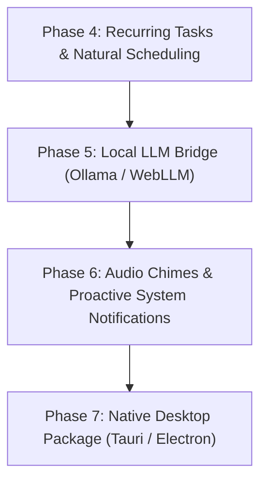

# 📋 AetherTask AI — System Implementation & Progress Tracking Plan

> **Project**: AetherTask AI (Autonomous, Local-First Intelligent Task & Productivity Orchestrator)  
> **Repository**: `d:\To-do agent`  
> **Status**: **Phase 1 & 2 Completed (Production-Ready MVP)** | **Phase 3 & 4 Roadmap Ready for Execution**  
> **Last Updated**: 2026-09-12

---

## 🧭 Executive Summary

**AetherTask AI** is a modern, privacy-first, autonomous task orchestrator built with **React 18, TypeScript, Tailwind CSS, and Zustand**. Unlike conventional to-do apps that act as passive task graveyards, AetherTask features an **autonomous agent** that actively decomposes high-level goals into estimated milestone checklists, triages overdue deadlines, balances priority matrices, and provides an integrated deep-work environment with synthesized ambient soundscapes.

This document serves as the **single source of truth** for:
1. Everything built, tested, and working today.
2. Architecture and code contracts.
3. Pending features, enhancements, and roadmap items ready to be built next.

---

## 📊 High-Level Implementation Status

```
[████████████████████████████████░░░░░░░░] 75% Complete

✅ Phase 1: Core Foundation & Multi-View Architecture (100% DONE)
✅ Phase 2: Autonomous Agent Engine & Tool Execution (100% DONE)
✅ Phase 3: Data Portability, Exporters & Audio Synthesizer (100% DONE)
🟡 Phase 4: Recurring Tasks, Recurrence Engine & Enhanced Drag-and-Drop (PLANNED / NEXT UP)
⚪ Phase 5: Native Desktop Integration & Local LLM Bridge (Ollama / WebGPU) (PLANNED)
⚪ Phase 6: Multi-Device Sync & P2P / Cloud Connector (FUTURE)
```

---

## ✅ Completed Implementations (Phases 1, 2 & 3)

### 1. 🤖 Autonomous Agent Engine (`src/services/aiService.ts`)
- [x] **Zero-Config Offline Heuristics Engine**:
  - Operates 100% client-side with zero external API keys or network latency.
  - Automatically identifies user intents using fuzzy keyword matching and regex parsing.
- [x] **Autonomous Tool Calling Loop**:
  - `decompose_goal`: Deconstructs complex inputs into 4–8 subtasks with realistic time budgets and priority tags.
  - `reschedule_overdue`: Scans the store, detects past-due items, re-anchors them to today, and updates status.
  - `balance_eisenhower`: Analyzes task criticality and moves items across 4 Eisenhower quadrants.
  - `generate_briefing`: Analyzes workload and outputs a structured daily briefing with top-3 focus deliverables.
  - `clear_completed`: Batch purges completed items.
- [x] **Multi-Provider AI Switcher**:
  - Built-in Heuristics (Default, offline).
  - Google Gemini API (`gemini-1.5-flash` integration with custom system instructions).
  - OpenAI-Compatible Endpoint (`gpt-4o`, Ollama, LM Studio, vLLM).
- [x] **Voice Dictation Integration**:
  - Native HTML5 Web Speech Recognition API bridge in the AI Drawer with live recording state indicators.

### 2. 🗂️ The 5 Core Views (`src/components/views/`)
- [x] **Hierarchical List View (`ListView.tsx`)**:
  - Collapsible inline subtask checklists with live completion meters.
  - One-click **"AI Decompose"** button on individual task rows.
  - Multi-select batch actions (Batch Complete, Batch Delete).
  - Interactive confetti animations on milestone completion (`canvas-confetti`).
  - Search, priority, project, and timeframe filters.
- [x] **Agile Kanban Board (`KanbanView.tsx`)**:
  - 4 status swimlanes: `To Do`, `In Progress`, `In Review`, `Done`.
  - Quick-move transitions with forward/backward controls on each task card.
  - Subtask completion progress bar, tag pills, and priority badges.
- [x] **Eisenhower Decision Matrix (`MatrixView.tsx`)**:
  - 4-Quadrant Urgency vs. Importance visual layout:
    - *Q1: Do First* (Urgent & Important)
    - *Q2: Schedule* (Not Urgent & Important)
    - *Q3: Delegate* (Urgent & Not Important)
    - *Q4: Eliminate* (Not Urgent & Not Important)
  - Dropdown quadrant re-allocation directly on cards.
- [x] **Zen Focus & Pomodoro Room (`FocusView.tsx`)**:
  - Pomodoro timer (25m Focus / 5m Short Break / 15m Long Break).
  - Task selector to anchor the current session to a specific backlog item.
  - **Built-in Web Audio API Ambient Sound Synthesizer**:
    - Generates real-time procedural audio: *Gentle Rain*, *Binaural Alpha Beats*, and *White Noise*.
    - Zero external MP3/audio files needed; 100% lightweight procedural synthesis.
- [x] **Productivity Telemetry Hub (`AnalyticsView.tsx`)**:
  - Real-time **Productivity Score (0–100)** computed from completion rate, focus minutes, and overdue tasks.
  - Priority distribution, quadrant breakdown, and project workload charts.

### 3. ⌨️ Global Navigation & Accessibility (`src/components/layout/`, `agent/`)
- [x] **Global Command Palette (`CommandPalette.tsx`)**:
  - Triggered with `Ctrl+K` or `Cmd+K`.
  - Search tasks, jump between views, execute agent commands, or create new items instantly.
- [x] **Keyboard Shortcuts System**:
  - `1-5`: Switch views (List, Kanban, Matrix, Focus, Analytics).
  - `N`: Open New Task modal.
  - `Ctrl+K`: Command palette.
  - `Esc`: Close any open overlay.
- [x] **Glassmorphism Dark Theme Design System**:
  - Dark slate and pure black glass panels with glowing emerald/mint accents.
  - Responsive sidebar and navigation header with task metrics badges.

### 4. 💾 Data Sovereignty & Portability (`src/services/exportService.ts`)
- [x] **Local-First Persistence**:
  - Zustand with `localStorage` persistence middleware (`todo-agent-storage`).
- [x] **Markdown Export (`.md`)**:
  - Exports formatted checklist compatible with GitHub, Obsidian, and Notion.
- [x] **iCalendar Export (`.ics`)**:
  - Standard RFC 5545 calendar file for Google Calendar, Apple Calendar, and Outlook.
- [x] **JSON Database Backup & Restore (`.json`)**:
  - Full non-destructive snapshot export and import for device migration.

---

## 🏗️ System Architecture & File Directory

```
d:/To-do agent/
├── docs/
│   └── images/
│       ├── banner.jpg                 # Hero dashboard showcase image
│       └── workflow.jpg               # AI task decomposition preview
├── src/
│   ├── components/
│   │   ├── agent/
│   │   │   ├── AgentDrawer.tsx        # Slide-over autonomous assistant chat & tool execution logs
│   │   │   └── CommandPalette.tsx     # Global Ctrl+K command bar
│   │   ├── layout/
│   │   │   ├── Navbar.tsx             # Top bar, view tabs, quick stats, & new task trigger
│   │   │   └── Sidebar.tsx            # Navigation, timeframes, projects & settings
│   │   ├── modals/
│   │   │   ├── SettingsModal.tsx      # AI provider keys, data backup/restore & exports
│   │   │   └── TaskModal.tsx          # Task creation/editing with in-modal AI decomposition
│   │   ├── ui/
│   │   │   └── ToastContainer.tsx     # Animated action confirmation toasts
│   │   └── views/
│   │       ├── AnalyticsView.tsx      # Productivity telemetry & distribution charts
│   │       ├── FocusView.tsx          # Pomodoro timer + Web Audio API synthesizer
│   │       ├── KanbanView.tsx         # 4-column Agile workflow board
│   │       ├── ListView.tsx           # Hierarchical checklist view with batch ops
│   │       └── MatrixView.tsx         # Eisenhower 4-quadrant decision matrix
│   ├── services/
│   │   ├── aiService.ts               # Autonomous agent engine, tool callers & API adapters
│   │   └── exportService.ts           # Markdown, JSON, and ICS exporters
│   ├── store/
│   │   └── useTaskStore.ts            # Zustand global state, task actions & persistence
│   ├── types/
│   │   └── index.ts                   # Core TypeScript interfaces & contracts
│   ├── App.tsx                        # Root layout orchestrator & keyboard listeners
│   ├── index.css                      # Custom styling, glassmorphic utilities & animations
│   └── main.tsx                       # React application bootstrapper
├── README.md                          # Interactive visitor documentation with charts
├── package.json                       # Dependencies & build scripts
├── tailwind.config.js                 # Theme tokens & emerald dark mode palette
├── tsconfig.json                      # Strict TypeScript compiler options
└── vite.config.ts                     # Vite build configuration
```

---

## 🎯 Next Steps & Implementation Roadmap

When you resume development, here are the prioritized, actionable milestones to tackle:



---

### 🟡 Phase 4: Recurring Tasks & Smart Scheduling (Priority: HIGH)

Currently, tasks have single due dates. Adding recurring schedules enables daily habits, weekly sprints, and monthly recurring reviews.

#### Specific Implementation Tasks:
1. **Extend Data Model (`src/types/index.ts`)**:
   ```typescript
   export type RecurrenceFrequency = 'none' | 'daily' | 'weekdays' | 'weekly' | 'monthly' | 'custom';

   export interface RecurrenceRule {
     frequency: RecurrenceFrequency;
     interval?: number;        // e.g., every 2 weeks
     daysOfWeek?: number[];    // 0=Sun, 1=Mon, ..., 6=Sat
     endDate?: string;
   }

   // Add to Task interface:
   // recurrence?: RecurrenceRule;
   // recurringParentId?: string;
   ```

2. **Auto-Spawn Next Instance in Store (`src/store/useTaskStore.ts`)**:
   - In `toggleTaskStatus`: When a recurring task is marked as `done`, automatically compute the next due date using `date-fns/addDays` or `addWeeks`, and spawn the next pending task instance.

3. **Recurrence Selector UI in `TaskModal.tsx`**:
   - Add a dropdown: `Does not repeat`, `Every day`, `Every weekday (Mon-Fri)`, `Every week`, `Monthly`.

---

### 🟡 Phase 5: Direct Local LLM Bridge (Ollama / WebLLM) (Priority: MEDIUM)

Currently, the user can configure OpenAI-compatible URLs, but a direct one-click preset for local Ollama running on `http://localhost:11434` makes it completely plug-and-play for local-AI enthusiasts.

#### Specific Implementation Tasks:
1. **Ollama Direct Provider in `aiService.ts`**:
   - Add a dedicated preset `provider === 'ollama'`.
   - Endpoint: `http://localhost:11434/api/generate` or `http://localhost:11434/v1/chat/completions`.
   - Add CORS handling tips in `SettingsModal.tsx` (`OLLAMA_ORIGINS="*" ollama serve`).
2. **Model Auto-Detection**:
   - Add a "Test Connection & Fetch Models" button in `SettingsModal.tsx` that calls `http://localhost:11434/api/tags` to populate available local models (e.g., `llama3.2:3b`, `mistral`, `qwen2.5-coder`).

---

### ⚪ Phase 6: Proactive Audio Chimes & Web Notifications (Priority: MEDIUM)

#### Specific Implementation Tasks:
1. **Pomodoro Completion Chime (`FocusView.tsx`)**:
   - Synthesize a gentle bell chime using `AudioContext` when a 25m focus or break interval reaches `00:00`.
2. **Browser Push / Desktop Notification API**:
   - Request `Notification.requestPermission()` in settings.
   - Fire a native browser notification when:
     - A task due date arrives.
     - A Pomodoro focus block completes.

---

### ⚪ Phase 7: Desktop Packaging via Tauri / Electron (Priority: LOW)

Convert AetherTask into an installable desktop `.exe`:
- Use **Tauri v2** with Rust for minimal binary size (< 15MB) and ultra-low RAM usage (< 30MB).
- Integrate global Windows shortcut (`Win + Shift + T` or `Ctrl + Shift + Space`) to trigger the Quick-Add or Command Palette from anywhere in Windows.
- Add a Windows System Tray icon with quick glance of today's tasks.

---

## 🧪 Verification & Health Checks

Run these commands to verify the health of the project anytime:

| Test / Check | Command | Expected Output |
| :--- | :--- | :--- |
| **TypeScript Validation** | `npm run build` (includes `tsc`) | Zero errors, bundle created in `dist/` |
| **Dev Server Execution** | `npm run dev` | Local server ready at `http://localhost:5173/` |
| **Lint & Syntax Check** | `npx tsc --noEmit` | Clean exit with code 0 |

---

## 🛠️ Quick Developer Commands

```bash
# 1. Enter repository
cd "d:/To-do agent"

# 2. Run local development server
npm run dev

# 3. Compile production build
npm run build

# 4. Preview compiled production bundle
npm run preview
```

---

## 📝 Developer Notes for Resuming Work

- **State Management**: All state is managed in [`src/store/useTaskStore.ts`](file:///d:/To-do%20agent/src/store/useTaskStore.ts). To add a new action or field, update [`src/types/index.ts`](file:///d:/To-do%20agent/src/types/index.ts) first, then implement the reducer/action in `useTaskStore.ts`.
- **Adding an Agent Tool**: Look at `executeAgentCommand` in [`src/services/aiService.ts`](file:///d:/To-do%20agent/src/services/aiService.ts). Tools return `{ reply: string, toolExecution: AgentToolExecution, affectedTaskIds?: string[] }`.
- **Styling**: Uses Tailwind CSS classes with custom color tokens defined in [`tailwind.config.js`](file:///d:/To-do%20agent/tailwind.config.js) (`surface-*`, `brand-*`, `accent-*`).
